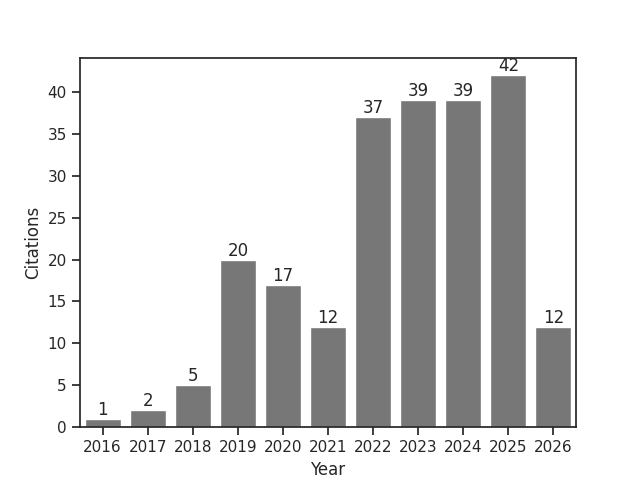

<table>
  <tr>
    <td width="60%">
      <h3>About me </h3>
      

        <b>Hi there👋!</b>  My name is <b>Miguel García</b> and I am a Product Specialist and Research Consultant at Pupil Labs 👁️‍🗨️. 
  Previously, I worked as an Academic Researcher 📚 at the University of Tübingen and as Early Stage Researcher at Carl Zeiss Vision in the framework of European Research Grants. 
  I have a Ph.D. in Neuroscience where I focused on myopia research 👓, and previously I completed my bachelor's and master's degrees in Optics and Optometry 👁️.
   
  I am passionate about using technology to solve real-world problems, and I am always looking for new challenges and opportunities to learn and grow.
  

    </td>
    <td width="40%">
      <h3>Cited by:</h3>
      
    </td>
  </tr>
  <tr>
    <td width="60%">
      <a href="https://mgg.contact/">mgg.contact</a>
       
    </td>
    <td width="40%">
      This graph is automatically updated every day, parsing Google Scholar and using Github Actions
    </td>
  </tr>
</table>
